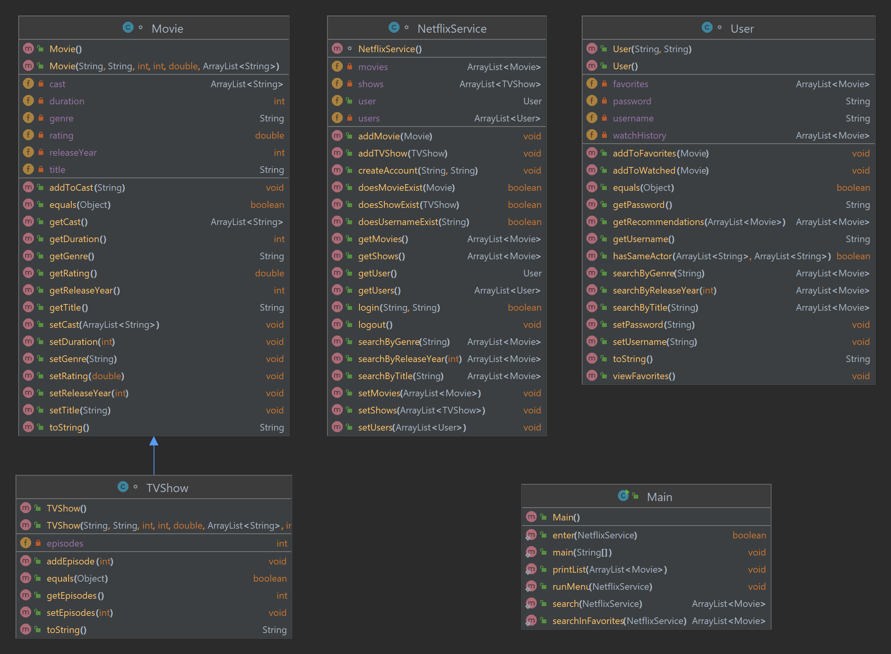

# Fourth Assignment : Netflix

## Introduction
In this assignment, I created a simulation of Netflix. The program allows users to create and manage their accounts and profiles, browse movies, and manage their movies. The program is designed using OOP principles.

## Design and Implementation
- First I completed classes `Movie`, `User`, `TVShow` and `NetflixService` by implementing required functions.  
- In this program, since TV show has an instance variable as number of episodes in addition to all attributes and methods of a movie, `TVShow` inherits from the `Movie` class . So it is slightly different from the original template.  
- The `equals` and `toString` functions are overridden in all classes. Also required constructors and getter/setter methods are implemented in each class.
- I had problems in the process of log in/create account. This was because the instance variables (including current user) in `NetflixService` was only defined, so I initialized them to null or empty Arraylists, and it could solve the problem.
- This program authenticates the login information and prevents the creation of two accounts with the same username.
- Recommendations are based on favorite movies. Movies with the same genre or a similar cast are suggested.
- Bellow is the UML diagram visualizing all classes.

